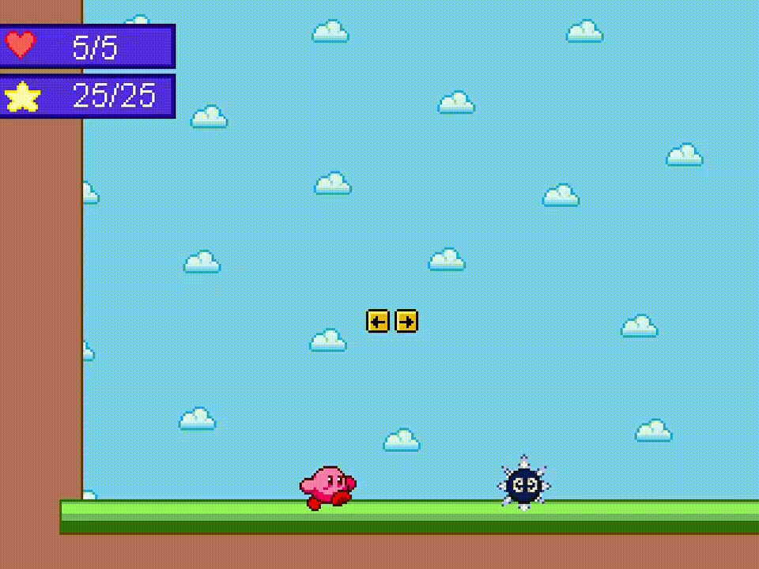
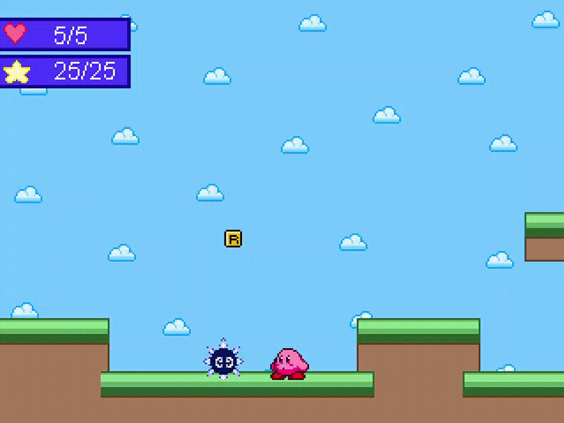
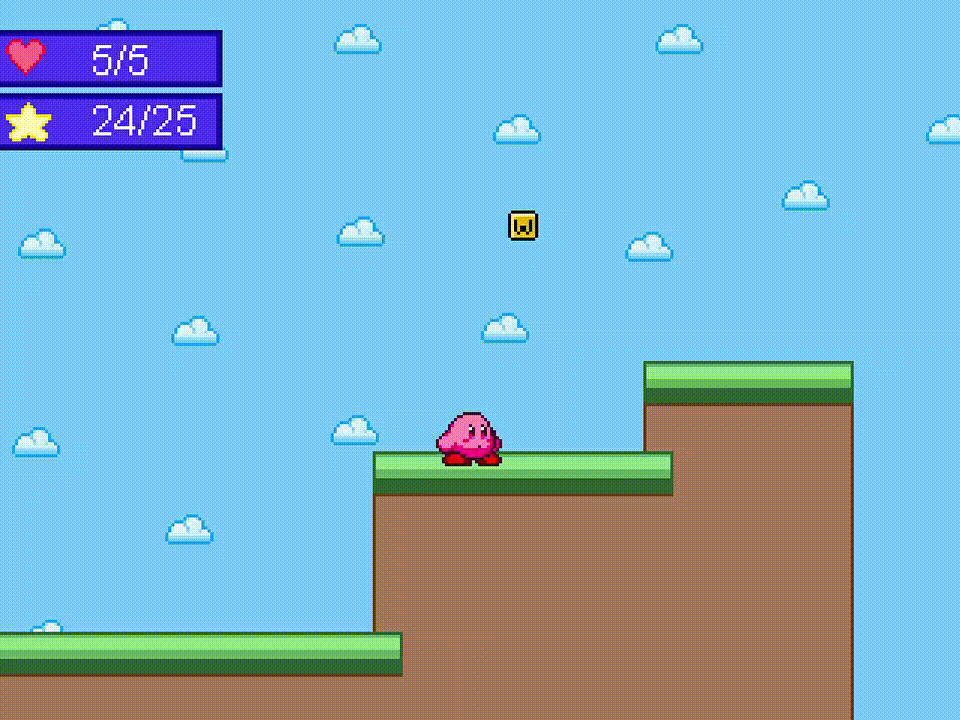
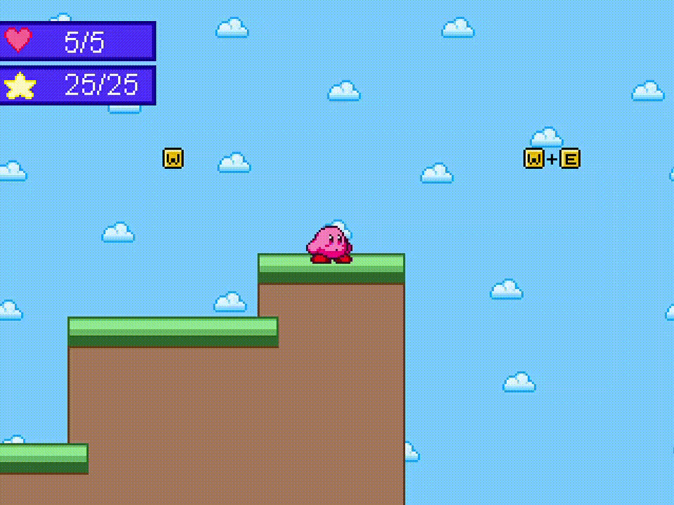

# Kirby-Run
My attempt at making a platformer game. I drew all of the sprites on my own.
I decided to use Kirby as the main character for the game. This project is not done yet. Still need to add a health bar, enemies, and update a few sprites.

Controls:
F to shoot  

R to kick  

W to jump  

W + E to glide  

